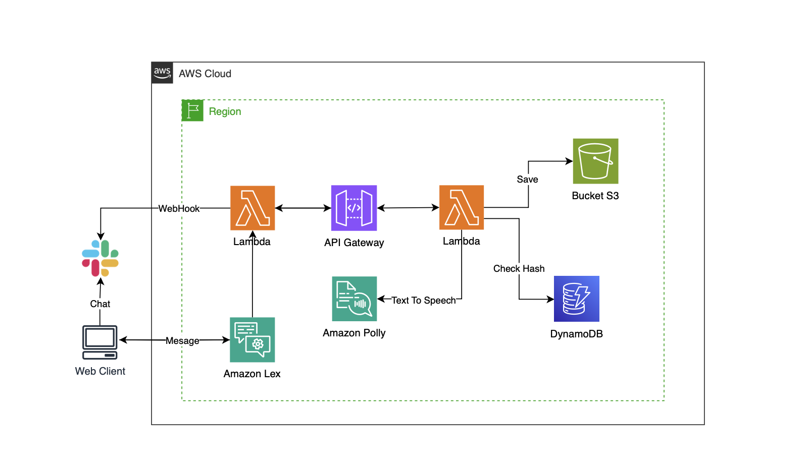

# AMAZON LEX TTS CHATBOT WITH SLACK

### **OVERVIEW**

The Ticket Reservation Chatbot integrated with Slack offers the additional functionality of text-to-speech (TTS) conversion via a serverless API. Users can search for and book travel tickets directly within Slack, receiving responses in both text and audio for a more efficient user experience.

[](https://skillicons.dev)

---

### **PROJECT ARCHITECTURE**



---

### **API TTS**

| Method | Endpoint                                                 | Description      |
| ------ | -------------------------------------------------------- | ---------------- |
| GET    | https://xxxxx.execute-api.us-east-1.amazonaws.com/       | Check Health API |
| GET    | https://xxxxx.execute-api.us-east-1.amazonaws.com/v1     | Description API  |
| POST   | https://xxxxx.execute-api.us-east-1.amazonaws.com/v1/tts | Text to Speech   |

The API was developed with the following components and functionalities:

- **Input Reception and Validation:** Receives a JSON payload containing a phrase and validates the input.
- **Unique ID Generation:** Generates a unique identifier for the phrase using a hash function.
- **Existence Check:** Checks DynamoDB to see if the audio for the phrase already exists.
- **Text-to-Speech Conversion:** Converts the phrase into audio using Amazon Polly.
- **Upload to S3:** Uploads the generated audio to an S3 bucket.
- **DynamoDB Registration**: Registers the audio metadata in DynamoDB, including the received phrase, audio URL, and creation date.

Expected JSON Body Format for POST Request:

```json
{
  "phrase": "Example Phrase for Audio Conversion"
}
```

---

### **TICKET RESERVATION CHATBOT**

> [!NOTE]
> The travel ticket reservation chatbot was developed using Amazon Lex and is integrated with Slack. It features text-to-speech (TTS) conversion functionality via a TTS API. Users can search for and book travel tickets directly within Slack, receiving responses in both text and audio for a more efficient user experience.

---

### **TECHNICAL DETAILS**

- **Integration with Slack**: The bot is integrated with Slack, enabling direct interaction within the workspace environment.

- **Serverless API for TTS Conversion**: We utilize a serverless architecture for the text-to-speech conversion API, ensuring scalability and efficiency.

- **Development Process**: The development process involved creating intuitive dialogue flows to accurately understand and respond to user requests.

---

### **CONFIGURE SERVERLESS**

In the _serverless.yml_ file, modify the `DYNAMODB_TABLE` and `S3_BUCKET` variables with the respective names of your DynamoDB table and S3 bucket.

> [!WARNING]
> Pay close attention to the permissions and public visibility settings when creating the S3 bucket. Users in Slack can only access the audio converted by the TTS API if the objects in the bucket have public access, which goes against AWS recommendations regarding public access.

Install serverless framework `npm install -g serverless`.

Configure your AWS credentials managed by IAM:

```ruby
$ aws configure
AWS Access Key ID [None]: ACCESSKEYEXAMPLE
AWS Secret Access Key [None]: SECRETKEYEXAMPLE
Default region name [None]: us-east-1
Default output format [None]: ENTER
```

Deploy the serverless application by running: `serverless deploy`.

---

### **CONFIGURE AMAZON LEX**

Import the zip file located in the `/bot` directory into Amazon Lex.

> [!CAUTION]
> Credentials should remain local to your environment only. Never expose your credentials in the README or any other part of the code.

Create a new Lambda function in AWS, import the libs.zip file located in the `/aws` directory, and add the `lambda_function.py` file to the root of the Lambda. Link the created function in Amazon Lex as the function to be invoked for Fulfillment.

> [!IMPORTANT]
> Increase the Lambda function timeout by accessing the general settings and modifying it to 5 seconds. Ensure the necessary read permissions to the S3 bucket are granted to the IAM role associated with the Lambda function.

---

### **AUTHORS**

[Adelson Teodoro](https://github.com/imrooteodoro) | [Giovane Iwamoto](https://github.com/GiovaneIwamoto) | [Gustavo Vasconcelos](https://github.com/GustavoSVasconcelos)

Giovane Hashinokuti Iwamoto - Computer Science student at UFMS - Brazil - MS

I am always open to receiving constructive criticism and suggestions for improvement in my developed code. I believe that feedback is an essential part of the learning and growth process, and I am eager to learn from others and make my code the best it can be. Whether it's a minor tweak or a major overhaul, I am willing to consider all suggestions and implement the changes that will benefit my code and its users.
